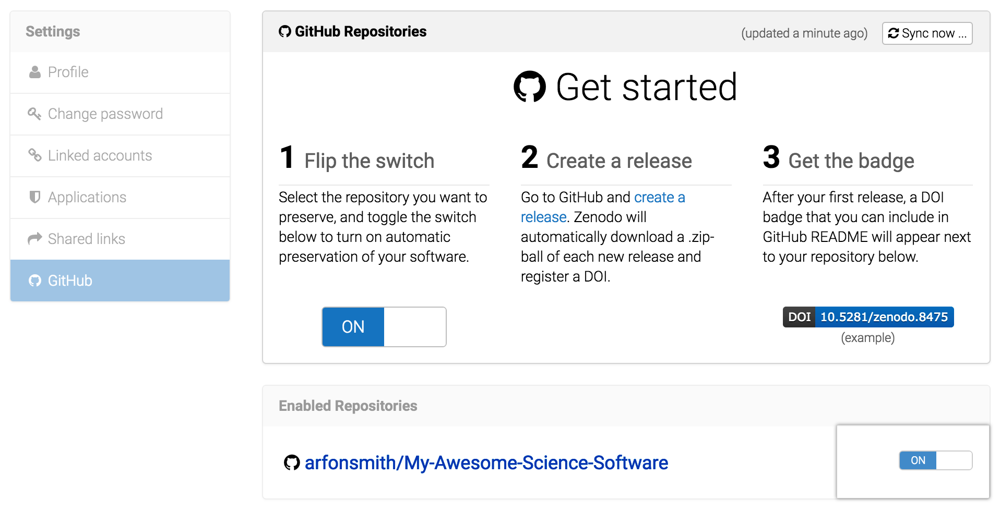
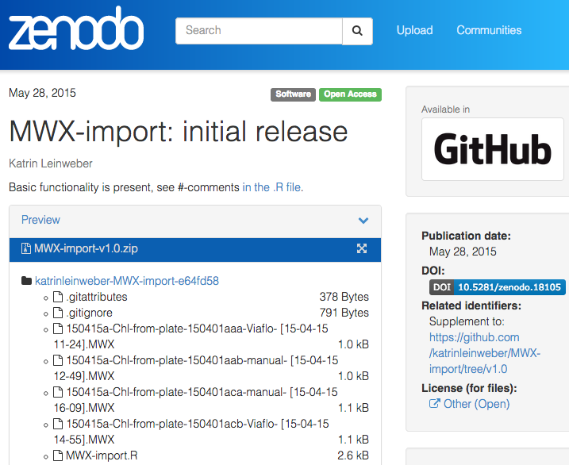
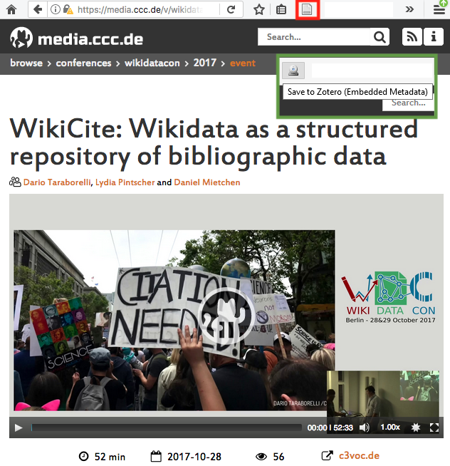

% Closing The Gaps In The Software Citation Workflow. One `@software{...}` Citekey At A Time.
% Katrin Leinweber
% 34c3 - 2017-12-30


## Me: kind of a ["software librarian" at TIB(.eu)](https://www.tib.eu/en/research-development/non-textual-materials/)

> - German National Library of Science and Technology, Hannover
> - scientific software services, FAIR data principles, etc.
> - Disclaimer: I'm here as an interested user. Not on behalf of any organisation or project mentioned herein.


## State of the Citation

- scientists credit each other by citing journal articles, books, etc.
    + see 34c3 talks: "[Science is Broken](https://media.ccc.de/v/34c3-9055-science_is_broken)" & "[Algorithmic science evaluation and power structure](https://media.ccc.de/v/34c3-9030-algorithmic_science_evaluation_and_power_structure_the_discourse_on_strategic_citation_and_citation_cartels)"
    + reproducibility crisis => increased interest in data citations
- also: software not equally accepted as citable unit of work, yet (scripts, packages, source code, etc.)
- some community infrastructures: [Debian Science](https://wiki.debian.org/DebianScience), [rOpenSci](https://ropensci.org/), [CRAN](https://cran.r-project.org/), [swMATH.org](http://swmath.org/), [SoftwareHeritage.org](https://www.softwareheritage.org/), etc.


# Solution examples for everyone else (#tuwat at the source)


## 1. [Guides.GitHub.com/activities/citable-code](https://guides.github.com/activities/citable-code/) + [Zenodo.org](https://zenodo.org/) + Git release = *D*igital *O*bject *I*dentifier…




## … plus a free backup at CERN ;-)




## 2. `CITATION` files

- like `LICENSE`, `COPYING`, `INSTALL`, etc.
- Make a wish![^CITATION]
- Don't be shy! Try `@software{...}`
    + compatible with [BibLaTeX](https://ctan.org/tex-archive/macros/latex/contrib/biblatex), [biber](https://github.com/plk/biber), [Zotero](http://zotero.org/), etc.
    + more examples: [GitHub.com/search?q=filename:CITATION](https://github.com/search?q=filename:CITATION)

```BibLaTeX
@book{wickham_ggplot2_2009,
    author = {Hadley Wickham},
    title = {ggplot2: elegant graphics for data analysis},
    ...},
}
```

[^CITATION]: in BibTeX... [Robin Wilson (2013) "Encouraging citation of software – introducing CITATION files" blog.RTWilson.com/2013/08](http://blog.rtwilson.com/encouraging-citation-of- software-introducing-citation-files/)


## 3. upcoming: tool-agnostic `codemeta.json`[^cmp] standard

- example from R community: native `DESCRIPTION` translated by "codemetaR" into:

```json
{"@context": [
    "http://purl.org/codemeta/2.0", 
    "http://schema.org"
    ],
  "@id": "https://doi.org10.5281/zenodo.1048320",
  "@type": "SoftwareSourceCode",
  "identifier": "codemetar",
  "description": "... defines a 'JSON-LD' format for ...",
  "issueTracker": "https://github.com/ropensci/codemetar/issues", 
  ...}
```

[^cmp]: [CodeMeta.GitHub.io](https://codemeta.github.io/)


# Offering metadata is necessary (but not sufficient!) for improving software citation workflows.


## #tuwat++

- in 2018, watch out for [CiteAs.org](http://citeas.org/) and [YAML-based Citation-File-Format.GitHub.io](https://citation-file-format.github.io/)
- upstream: build [codemetaR](https://github.com/ropensci/codemetar)-like packages / plug-ins for other languages, IDEs, etc.
- downstream: contribute [GitHub.com/Zotero/translators](http://github.com/zotero/translators) (.js to extract bibliographic info from websites)


## #tuwat++ Zotero translator for [media.ccc.de](https://media.ccc.de/)




## Thanks for your attention! Questions, comments, hints? [New issue here](https://github.com/katrinleinweber/171228-34c3-lightning-software-citation/issues/new), please! Thanks :-)

[](https://creativecommons.org/licenses/by/4.0/)

### Further reading / watching

> - [Smith AM, Katz DS, Niemeyer KE, FORCE11 Software Citation Working Group. (2016) Software citation principles. PeerJ Computer Science 2:e86 doi.org/10.7717/peerj-cs.86](https://peerj.com/articles/cs-86/) 
> - [Katherine Thornton & Finn Årup Nielsen: "Describing Software So We Can Cite Software" media.ccc.de/v/wikidatacon2017-10013](https://media.ccc.de/v/wikidatacon2017-10013-describing_software_so_we_can_cite_software)
> - [GitHub.com/FORCE11/FORCE11-SCIWG](https://github.com/force11/force11-sciwg) (Software Citation Implementation Working Group of the Future of Research Communication and E-Scholarship)
